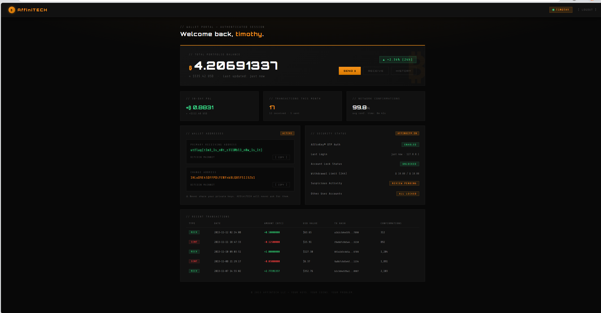

# Write-up: Time to Pretend

## Tổng quan

Challenge này cho một trang đăng nhập ví Bitcoin của **AffiniTECH** với giao diện khá “ngầu”, nhưng phần quan trọng nằm ở cơ chế đăng nhập. Form không hề có mật khẩu, chỉ có:

- `username`
- `otp`

Ngay từ đây có thể đoán bài sẽ xoay quanh việc phân tích và phá cơ chế sinh OTP, chứ không phải bypass một luồng login thông thường.

Mục tiêu là tìm được tài khoản còn hoạt động, tạo OTP hợp lệ, đăng nhập vào portal và lấy flag.

---

## Recon ban đầu

Khi mới vào chall, điều đầu tiên nên làm là mở source và xem JavaScript phía client đang gửi gì lên server.

Trong source có đoạn:

```javascript
fetch('/auth', {
  method: 'POST',
  headers: { 'Content-Type': 'application/json' },
  body: JSON.stringify({ username, otp })
})
```

Từ đây rút ra được vài ý:

1. Luồng auth khá đơn giản, dùng JSON POST tới `/auth`.
2. Server chỉ kiểm tra `username` và `otp`.
3. Nếu login thành công thì nhiều khả năng sẽ được redirect sang `/portal`.

Nói cách khác, bài toán thật sự là: **làm sao tạo ra OTP hợp lệ cho một username hợp lệ**.

---

## Phân tích source HTML

Sau khi đọc kỹ HTML, có 2 chi tiết cực kỳ đáng chú ý.

### 1. Comment của dev

```html
<!-- NOTICE to DEVS: login currently disabled, see /urgent.txt for info -->
```

Comment này gần như chỉ đường luôn: phải mở `/urgent.txt`.

### 2. Hint dưới ô nhập OTP

```html
// Request your AffinKey™ OTP via the debug endpoint
```

Hint này cho biết:

- Từng tồn tại một debug endpoint để lấy OTP
- OTP không phải thứ gì đó quá bí mật hay hoàn toàn ngẫu nhiên
- Cách giải có liên quan trực tiếp tới cơ chế sinh OTP

Vậy hướng đi đúng là:

1. đọc `/urgent.txt`
2. tìm hiểu debug endpoint / logic OTP

---

## Đọc `/urgent.txt`

File `/urgent.txt` là mảnh ghép quan trọng nhất ở giai đoạn đầu. Nội dung chính của nó cho biết:

- Có một lỗ hổng nghiêm trọng trong hệ AffinKey OTP
- Timothy đã khóa toàn bộ account trong hệ thống
- **Chỉ account của Timothy vẫn được giữ active** để theo dõi tình hình

Từ đây suy ra ngay 2 điều:

1. Username đáng để nhắm tới là **`timothy`**
2. Lỗ hổng nằm ở **cách generate OTP**

Bước này giúp thu hẹp phạm vi rất nhiều. Không còn phải đoán account nào còn dùng được nữa; gần như chắc chắn target đúng là `timothy`.

---

## Thử debug endpoint

Vì source nói “request your OTP via the debug endpoint”, phản xạ tự nhiên là thử một endpoint kiểu:

```text
/debug/getOTP
```

Tuy nhiên trên instance public, endpoint này trả về **404 Not Found**.

Điều đó có nghĩa là:

- Không thể lấy OTP trực tiếp nữa
- Nhưng hint này vẫn rất giá trị, vì nó xác nhận rằng OTP từng có thể được lấy ra thông qua một debug mechanism
- Tức là OTP nhiều khả năng được sinh theo cách **deterministic**, không phải random thật

Nói cách khác, endpoint chết rồi, nhưng logic phía sau nó vẫn có thể bị tái dựng.

---

## Khôi phục thuật toán OTP

Từ phần source leak / traffic / artifact đi kèm challenge, có thể khôi phục được logic sinh OTP.

Một mảng quan trọng lộ ra là:

```javascript
const mults = [1, 3, 5, 7, 9, 11, 15, 17, 19, 21, 23, 25];
```

Với một giá trị `epoch`, hệ OTP dùng:

```text
add  = epoch % 26
mult = mults[epoch % 12]
```

Sau đó mỗi ký tự trong username được mã hóa kiểu affine:

1. đổi `a..z` thành `0..25`
2. áp dụng công thức:

```text
enc = (mult * x + add) % 26
```

3. đổi ngược về chữ cái

Tức là OTP thực chất không phải mã ngẫu nhiên dùng một lần đúng nghĩa. Nó chỉ là **username bị biến đổi affine theo thời gian**.

---

## Insight quan trọng nhất: không cần biết chính xác giờ server

Ban đầu rất dễ nghĩ rằng phải biết đúng thời gian server để tính OTP. Nhưng nhìn kỹ công thức thì OTP chỉ phụ thuộc vào:

- `epoch % 26`
- `epoch % 12`

Hai giá trị này lặp lại theo chu kỳ:

```text
lcm(26, 12) = 156
```

Đây là điểm mấu chốt của bài.

Nó có nghĩa là toàn bộ OTP chỉ có tối đa **156 trạng thái khác nhau**.

Vì vậy:

- Không cần đồng bộ chính xác với server time
- Không cần đoán timestamp tuyệt đối
- Chỉ cần brute-force toàn bộ 156 residue là đủ

Đây chính là chỗ hệ OTP sụp hoàn toàn.

---

## Hướng exploit

Lúc này ta đã có:

- Username còn hoạt động là `timothy`
- OTP phụ thuộc vào một không gian trạng thái chỉ có 156 giá trị

Hướng tấn công đơn giản nhất là:

1. Tự reimplement hàm sinh OTP
2. Sinh tất cả OTP có thể có cho `timothy`
3. Gửi lần lượt từng giá trị lên `/auth`
4. Dừng lại khi server trả về thành công

Vì chỉ có 156 trường hợp nên brute-force ngay trong console trình duyệt là quá nhẹ.

---

## Script exploit cuối cùng

Dưới đây là script:

```javascript
(async () => {
  const username = "timothy";
  const mults = [1, 3, 5, 7, 9, 11, 15, 17, 19, 21, 23, 25];

  function otpForResidue(u, r) {
    const add = r % 26;
    const mult = mults[r % 12];
    return [...u].map(ch => {
      const x = ch.charCodeAt(0) - 97;
      return String.fromCharCode(97 + ((mult * x + add) % 26));
    }).join("");
  }

  const tried = new Set();

  for (let r = 0; r < 156; r++) {
    const otp = otpForResidue(username, r);
    if (tried.has(otp)) continue;
    tried.add(otp);

    const resp = await fetch("/auth", {
      method: "POST",
      headers: { "Content-Type": "application/json" },
      body: JSON.stringify({ username, otp })
    });

    const text = await resp.text();
    console.log(r, otp, resp.status, text);

    if (resp.ok) {
      console.log("SUCCESS OTP =", otp);
      location.href = "/portal";
      return;
    }
  }

  console.log("No valid OTP found for timothy");
})();
```

---

## Giải thích script

Script trên làm đúng các bước cần thiết:

1. Cố định username là `timothy` dựa trên thông tin trong `/urgent.txt`
2. Reimplement lại logic affine OTP
3. Duyệt toàn bộ 156 residue có thể có
4. Sinh OTP tương ứng cho từng residue
5. Gửi từng OTP lên `/auth`
6. Khi gặp response thành công thì redirect sang `/portal`

Do không gian trạng thái cực nhỏ, brute-force như vậy là đủ để phá hệ xác thực.

Sau khi đăng nhập thành công, trang `/portal` hiện ra dashboard ví của Timothy.



---

## Flag

```text
utflag{t1m3_1s_n0t_r3ll0b1l3_n0w_1s_1t}
```

---

## Tóm tắt toàn bộ hướng giải

Luồng suy nghĩ hợp lý để solve bài này là:

1. Vào chall và xem luồng login hoạt động thế nào
2. Mở source HTML
3. Thấy comment dẫn tới `/urgent.txt`
4. Đọc `/urgent.txt` và xác định chỉ `timothy` còn active
5. Thấy hint về debug endpoint
6. Khôi phục logic sinh OTP từ leak/artifact
7. Nhận ra OTP chỉ phụ thuộc vào `epoch % 26` và `epoch % 12`
8. Tính ra chu kỳ lặp chỉ là 156
9. Brute-force toàn bộ OTP cho `timothy`
10. Login vào portal và lấy flag

---

## Nguyên nhân gốc của lỗ hổng

Sai lầm lớn nhất của hệ AffinKey OTP là:

- OTP không random thật
- OTP được sinh deterministically từ username
- Nó chỉ dùng một affine transform rất yếu
- Thành phần thời gian bị co lại thành một không gian cực nhỏ
- Tổng số trạng thái thực tế chỉ có 156

Điều đó khiến OTP có thể bị brute-force cực nhanh và hoàn toàn không đủ an toàn để dùng làm cơ chế xác thực.

---

## Kết luận

Bài này là một ví dụ điển hình của việc “tự chế” auth scheme rồi tin rằng nó an toàn chỉ vì nó trông khác thường. Về bản chất, AffinKey không phải OTP mạnh mà chỉ là một phép biến đổi tuyến tính theo thời gian với số trạng thái rất nhỏ.

Chỉ cần:

- đọc đúng hint trong source
- xác định đúng user từ `/urgent.txt`
- nhận ra chu kỳ lặp 156 trạng thái

là có thể viết script brute-force để vào thẳng portal.
