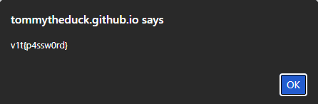

# Challenge Writeup: Login Panel

**Category:** Web

## Tóm tắt

Đây là một thử thách web sử dụng JavaScript phía client để kiểm tra đăng nhập. Trang web sẽ tính hash SHA-256 của `username` và `password` mà người dùng nhập vào, rồi so sánh với hai chuỗi hex được hardcode sẵn trong mã nguồn.

Nếu cả hai hash đều khớp, trang sẽ chạy:

```javascript
alert(username + '{' + password + '}');
```

Điều này đồng nghĩa với việc flag sẽ hiện ra theo định dạng:

```text
username{password}
```

Vì cả hai giá trị hash mục tiêu đều lộ rõ trong source code, bài toán thực chất chỉ còn là tìm **preimage** cho từng hash: một cho `username` và một cho `password`.

`username` được đoán khá dễ nhờ format của flag, còn `password` được crack bằng wordlist attack với `rockyou.txt`.

---

## Source code

```html
<!doctype html>
<html lang="en">
<head>
  <meta charset="utf-8" />
  <meta name="viewport" content="width=device-width,initial-scale=1" />
  <title>Login Panel</title>
</head>
<body>
  <script>
    async function toHex(buffer) {
      const bytes = new Uint8Array(buffer);
      let hex = '';
      for (let i = 0; i < bytes.length; i++) {
        hex += bytes[i].toString(16).padStart(2, '0');
      }
      return hex;
    }

    async function sha256Hex(str) {
      const enc = new TextEncoder();
      const data = enc.encode(str);
      const digest = await crypto.subtle.digest('SHA-256', data);
      return toHex(digest);
    }l

    function timingSafeEqualHex(a, b) {
      if (a.length !== b.length) return false;
      let diff = 0;
      for (let i = 0; i < a.length; i++) {
        diff |= a.charCodeAt(i) ^ b.charCodeAt(i);
      }
      return diff === 0;
    }

    (async () => {
      const ajnsdjkamsf = 'ba773c013e5c07e8831bdb2f1cee06f349ea1da550ef4766f5e7f7ec842d836e';
      const lanfffiewnu = '48d2a5bbcf422ccd1b69e2a82fb90bafb52384953e77e304bef856084be052b6';

      const username = prompt('Enter username:');
      const password = prompt('Enter password:');

      if (username === null || password === null) {
        alert('Missing username or password');
        return;
      }

      const uHash = await sha256Hex(username);
      const pHash = await sha256Hex(password);

      if (timingSafeEqualHex(uHash, ajnsdjkamsf) &&
          timingSafeEqualHex(pHash, lanfffiewnu)) {
        alert(username + '{' + password + '}');
      } else {
        alert('Invalid credentials');
      }
    })();
  </script>
</body>
</html>
```

---

## Phân tích hoạt động của trang

Trang web thực hiện các bước sau:

1. Hiện hai hộp thoại `prompt()` để người dùng nhập `username` và `password`.
2. Tính:
   - `sha256(username)`
   - `sha256(password)`
3. So sánh hai giá trị hash đó với hai chuỗi hex được hardcode sẵn trong JavaScript.
4. Nếu cả hai cùng đúng thì hiển thị:

```javascript
alert(username + '{' + password + '}');
```

### Các dòng quan trọng

```javascript
const ajnsdjkamsf = 'ba773c013e5c07e8831bdb2f1cee06f349ea1da550ef4766f5e7f7ec842d836e'; // username hash
const lanfffiewnu = '48d2a5bbcf422ccd1b69e2a82fb90bafb52384953e77e304bef856084be052b6'; // password hash

const uHash = await sha256Hex(username);
const pHash = await sha256Hex(password);

if (timingSafeEqualHex(uHash, ajnsdjkamsf) &&
    timingSafeEqualHex(pHash, lanfffiewnu)) {
  alert(username + '{' + password + '}');
}
```

---

## Vì sao bài này giải được?

Điểm yếu chính là **toàn bộ logic xác thực nằm ở phía client**. Điều đó có nghĩa là người chơi hoàn toàn có thể đọc source code và lấy được:

- hash của `username`
- hash của `password`

SHA-256 là hàm băm một chiều, nhưng nếu đầu vào ngắn, dễ đoán hoặc phổ biến thì hoàn toàn có thể brute-force hoặc dùng wordlist để tìm lại.

Trong bài này:

- `username` có thể đoán được từ format của flag
- `password` là một mật khẩu phổ biến và có trong các wordlist thông dụng

---

## Hướng giải

### 1. Trích xuất hai hash từ source code

Mở source của trang hoặc DevTools và lấy ra hai chuỗi hash:

```text
sha256(username) = ba773c013e5c07e8831bdb2f1cee06f349ea1da550ef4766f5e7f7ec842d836e
sha256(password) = 48d2a5bbcf422ccd1b69e2a82fb90bafb52384953e77e304bef856084be052b6
```

Đây là hai giá trị cần tìm preimage.

---

### 2. Tìm username

Đề bài cho biết flag có format:

```text
v1t{...}
```

Điều này gợi ý rất mạnh rằng phần trước dấu ngoặc nhọn chính là `v1t`, tức `username = "v1t"`.

Kiểm tra bằng Python:

```python
import hashlib
print(hashlib.sha256(b"v1t").hexdigest())
```

Kết quả:

```text
ba773c013e5c07e8831bdb2f1cee06f349ea1da550ef4766f5e7f7ec842d836e
```

Hash này khớp hoàn toàn với hash `username` trong source code.

Vậy:

```text
username = v1t
```

---

### 3. Crack password bằng wordlist attack

Hash thứ hai có vẻ là của một mật khẩu dễ nhớ, nên hướng hợp lý là dùng wordlist attack với `rockyou.txt`.

Lưu hash vào file:

```bash
echo "48d2a5bbcf422ccd1b69e2a82fb90bafb52384953e77e304bef856084be052b6" > pass.hash
```

Sau đó chạy `hashcat` với mode SHA-256 (`-m 1400`):

```bash
hashcat -m 1400 pass.hash /path/to/rockyou.txt
```

Kết quả tìm được:

```text
p4ssw0rd
```

Vậy:

```text
password = p4ssw0rd
```

---

### 4. Xác minh lại trên trang

Nhập vào form:

```text
username: v1t
password: p4ssw0rd
```

Trang sẽ hiển thị:



---

## Flag

```text
v1t{p4ssw0rd}
```

---

## Kết luận

Bài này khai thác lỗi thiết kế rất cơ bản: đưa toàn bộ cơ chế xác thực ra phía client. Khi hash mục tiêu đã lộ trong JavaScript, việc xác thực không còn ý nghĩa bảo mật nữa. Người chơi chỉ cần tìm lại đầu vào phù hợp cho từng hash.

