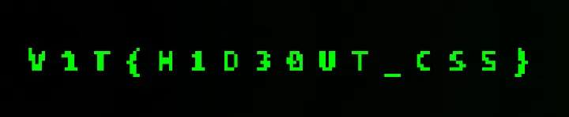

# Challenge Writeup: Stylish Flag

**Category:** Web

## Tóm tắt

Bài này giấu flag hoàn toàn trong **CSS**. Trong HTML có một thẻ `<div class="flag">` nhưng bị ẩn bằng thuộc tính `hidden`. Phần CSS dùng một khối vuông nhỏ kích thước **8×8** với màu xanh lá, sau đó nhân bản nó thành rất nhiều điểm ảnh bằng `box-shadow` để vẽ ra cả một hình pixel-art. Khi bỏ `hidden` hoặc chỉnh lại CSS như `opacity`, `transform`, nền hiển thị..., hình sẽ hiện ra và để lộ flag.

## Trang web làm gì

Khi mở trang, chỉ thấy dòng chữ:

`where is the flag ;-;`

Ngoài ra không thấy gì đặc biệt.

Xem mã nguồn sẽ thấy:

- HTML chứa thẻ:

```html
<div hidden class="flag"></div>
```

- File CSS định nghĩa `.flag` như sau:

```css
.flag {
    width: 8px;
    height: 8px;
    background: #0f0;
    transform: rotate(180deg);
    opacity: 0.05;
    box-shadow:
        264px 0px #0f0,
        1200px 0px #0f0,
        0px 8px #0f0,
        32px 8px #0f0,
        /* ... rất nhiều tọa độ khác ... */
        1200px 64px #0f0;
}
```

Điều này cho thấy tác giả dùng **CSS pixel-art**: một ô vuông 8×8 được sao chép ra nhiều vị trí khác nhau bằng `box-shadow`, từ đó tạo thành một hình lớn chứa nội dung flag.

## Ý tưởng giải

Vì dữ liệu vẽ hình nằm hết trong CSS nên không cần khai thác gì phức tạp. Chỉ cần:

1. Xem source HTML/CSS.
2. Nhận ra `.flag` đang bị ẩn.
3. Bỏ thuộc tính `hidden` hoặc chỉnh CSS để hiện rõ phần tử.
4. Mở lại trang và đọc flag từ hình pixel-art.

## Các bước làm

### 1. Xem source của trang

Mình kiểm tra mã HTML và CSS, thấy có một `div.flag` bị ẩn và phần `box-shadow` cực dài. Đây là dấu hiệu rất quen thuộc của kỹ thuật vẽ hình bằng CSS.

### 2. Hiển thị phần tử bị ẩn

- Tạo file HTML local để preview dễ hơn

Để xem rõ hình hơn, tạo một file HTML riêng, nhúng CSS vào luôn và cho nền tối. Ví dụ:

```html
<!doctype html>
<html lang="en">
<head>
  <meta charset="utf-8" />
  <title>CTF Flag Render</title>
  <style>
    body {
      background: radial-gradient(circle at center, #000 0%, rgb(0, 6, 0) 80%);
      display: flex;
      justify-content: center;
      align-items: center;
      height: 100vh;
      overflow: hidden;
    }

    .flag {
      width: 8px;
      height: 8px;
      background: #0f0;
      box-shadow:
        264px 0px #0f0,
        1200px 0px #0f0,
        0px 8px #0f0,
        32px 8px #0f0,
        /* ... toàn bộ box-shadow gốc ... */
        1200px 64px #0f0;
    }
  </style>
</head>
<body>
  <div class="flag"></div>
</body>
</html>
```

Sau khi lưu file và mở bằng trình duyệt, hình pixel-art hiện ra rõ ràng.

### 4. Đọc flag

Khi phần hình được render đầy đủ, flag hiện ra là:



## Flag

```text
v1t{h1d30ut_css}
```

## Kết luận

Đây là một bài Web khá nhẹ, chủ yếu kiểm tra khả năng quan sát source và nhận ra cách giấu thông tin trong CSS. Không có logic backend hay JavaScript phức tạp, toàn bộ nội dung flag đã nằm sẵn trong stylesheet. Chỉ cần làm cho phần tử hiển thị lại là có thể đọc được flag.

## Ghi chú

- `.flag` là một khối cơ sở kích thước **8×8**.
- `box-shadow` được dùng để tạo ra hàng loạt pixel ở các tọa độ khác nhau.
- `hidden` và `opacity: 0.05` là hai lý do chính khiến hình gần như không thấy được trên trang ban đầu.
- Cách giải nhanh nhất là chỉnh trực tiếp bằng **DevTools** hoặc dựng lại một file HTML local để preview.

