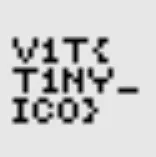

# Challenge Writeup: Tiny Flag

**Category:** Web

## Tóm tắt

Đây là một thử thách web khá đơn giản, trong đó flag được **ẩn ngay trước mắt người chơi** — bên trong **favicon** của trang web (`favicon.ico`).

Ngay từ tiêu đề **“Tiny Flag”** và gợi ý **“The actual flag is tiny”**, có thể suy ra rằng manh mối đang nhắm tới một thành phần rất nhỏ trên trang, và favicon là ứng viên hợp lý nhất.

## Các bước giải

### 1. Mở trang challenge

Khi truy cập vào trang, giao diện chỉ hiển thị một dòng trang trí với nội dung:

> **Tiny flag — look closely ✨**

Không có form nhập liệu, không có script kiểm tra, cũng không có tương tác đặc biệt nào đáng chú ý.

### 2. Xem source code

Tiếp theo, kiểm tra HTML của trang và thấy dòng sau:

```html
<link rel="shortcut icon" href="favicon.ico" type="image/x-icon">
```

Dòng này cho biết trang đang sử dụng một tệp favicon có tên là `favicon.ico`.

### 3. Mở trực tiếp favicon

Sau đó truy cập trực tiếp tới đường dẫn:

```text
/favicon.ico
```

Khi mở tệp favicon này, có thể thấy nội dung hình ảnh nhỏ chứa luôn flag.



## Flag

```text
v1t{t1ny_ic0}
```

## Kết luận

Ý tưởng của bài là giấu flag trong một vị trí rất dễ bị bỏ qua: **favicon** của website. Chỉ cần chú ý đến tiêu đề bài và kiểm tra mã nguồn HTML là có thể nhanh chóng tìm ra hướng giải.

