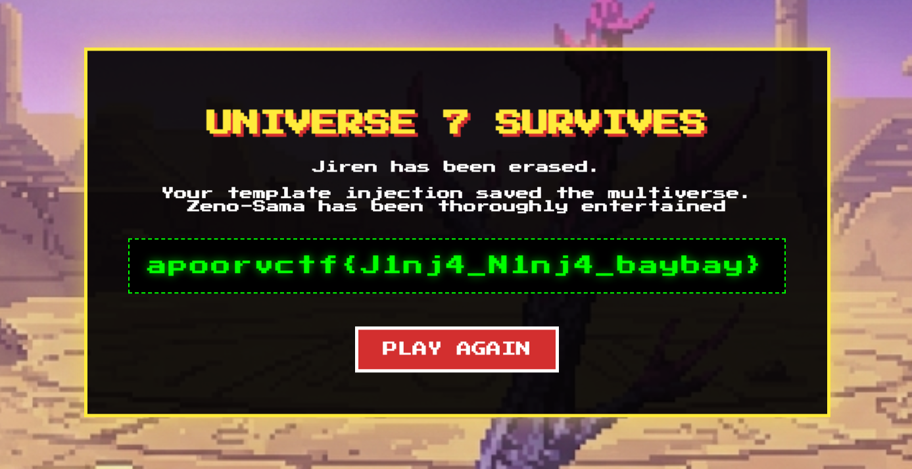

# KameHame-Hack — Write-up

**Category:** Web  
**Difficulty:** Hard

## Tổng quan

Challenge là một web game phong cách Dragon Ball. Người chơi có thể qua từng stage bằng cách bấm `ATTACK`. Kết quả thắng thua không được tính ở frontend mà phụ thuộc vào phản hồi từ server tại endpoint `/attack`.

Source HTML/JS của arena cho thấy hai điểm rất quan trọng:

1. Frontend chỉ gửi `POST /attack` rồi chờ server trả về `"WIN"` hay thua.
2. Trong source có một comment gợi ý trực tiếp đến `update()` và `__dict__`.

Từ đây có thể suy ra hướng khai thác không nằm ở việc sửa giao diện, mà là can thiệp vào state phía server.

---

## Phân tích

### 1. Logic thắng thua nằm ở server

Đoạn quan trọng nhất ở frontend là:

```javascript
fetch("/attack", { method: "POST" })
  .then((response) => response.text())
  .then((result) => {
    if (result === "WIN") {
      location.reload();
    } else {
      window.location.href = "/";
    }
  });
```

Điều này cho thấy:

- frontend không tự tính damage
- frontend không tự quyết định thắng thua
- server tại `/attack` mới là nơi kiểm tra `power_level`

Vì thế, sửa DOM hoặc sửa số hiện trên giao diện sẽ không có tác dụng. Muốn thắng boss thì phải thay đổi dữ liệu mà server dùng để so sánh.

### 2. Hint chỉ thẳng vào object nội bộ

Trong source có comment:

```javascript
// "A Saiyan's true power is stored within. To surpass a God, one must update() their inner __dict__ionary."
```

Comment này gợi ra 3 ý:

- `true power is stored within`  
  => sức mạnh thật nằm trong object ở backend, không phải chỉ ở HTML

- `update()`  
  => cần gọi hàm `update`

- `__dict__ionary`  
  => ám chỉ `__dict__` trong Python


### 3. Vì sao nghĩ tới SSTI

Dựa trên source, challenge có các dấu hiệu sau khiến hướng SSTI rất hợp lý:

- Đây là web Flask/Jinja2-style challenge.
- Hint nói tới object Python (`__dict__`, `update()`), nghĩa là khả năng cao có một template expression đang được evaluate ở server.
- Mục tiêu cần sửa state của object backend ngay trong lúc xử lý request.
- Bài web kiểu này thường để user-controlled input đi vào `render_template_string()` hoặc vào template context một cách không an toàn.

Sau khi nghi SSTI, bước xác nhận thực tế sẽ là nhập một payload Jinja cơ bản vào trường tên người chơi, ví dụ:

```jinja2
{{7*7}}
```

rồi trigger request liên quan, ở đây là `ATTACK`.

Nếu payload được evaluate, ta xác nhận có SSTI.

### 4. Xác định mục tiêu cần sửa

Từ giao diện có thể thấy object người chơi chắc chắn có thông tin tương đương:

- tên
- power level

Nếu context của template có object `player`, thì các biểu thức kiểu sau rất đáng thử:

```jinja2
{{player}}
{{player.name}}
{{player.power_level}}
{{player.__dict__}}
```

Trong một game dạng này, field cần chỉnh gần như chắc chắn là:

```python
player.power_level
```

Vì `/attack` sẽ so sánh sức mạnh người chơi với enemy để trả `"WIN"` hoặc thua.

### 5. Tại sao lại dùng `__dict__.update(...)`

Khi đã xác định được mục tiêu là sửa `player.power_level`, có một số cách có thể nghĩ tới.

#### Cách quen thuộc nhưng dễ bị chặn

```python
player.__dict__['power_level'] = 9999999
```

hoặc

```python
player.__dict__.update({'power_level': 9999999})
```

Hai cách này đều cần string literal. Nếu input bị filter quote thì sẽ không dùng được.

#### Cách tốt hơn

```python
player.__dict__.update(power_level=9999999)
```

Điểm mạnh của cách này:

- không cần dùng dấu nháy
- đúng với hint `update()` + `__dict__`
- sửa trực tiếp thuộc tính của object

Đây là payload rất tự nhiên nếu suy luận từ hint và từ mục tiêu của game.

### 6. Payload khai thác

Payload dùng để sửa sức mạnh người chơi:

```jinja2
{{player.__dict__.update(power_level=9999999)}}
```

Khi Jinja evaluate biểu thức này:

- `player.__dict__` trả về dictionary các thuộc tính của object
- `update(power_level=9999999)` sẽ sửa trực tiếp `player.power_level`
- từ thời điểm đó, server sẽ dùng giá trị mới để so sánh khi xử lý `/attack`

Điểm quan trọng là `update()` trả về `None`, nhưng điều đó không ảnh hưởng vì thứ ta cần là **side effect**, không phải giá trị hiển thị.

---

- Kết quả thu được:



---

## Flag

```text
apoorvctf{J1nj4_N1nj4_baybay}
```

---

## Kết luận

Challenge này không yêu cầu RCE. Cốt lõi nằm ở việc:

- xác định logic game nằm ở server
- đọc được hint về `update()` và `__dict__`
- suy ra phải sửa object nội bộ thay vì phá frontend
- tận dụng SSTI để gọi method Python ngay trong template

Payload cuối cùng chỉ đơn giản là sửa trực tiếp `power_level` của `player`, và như vậy là đủ để vượt qua boss.

